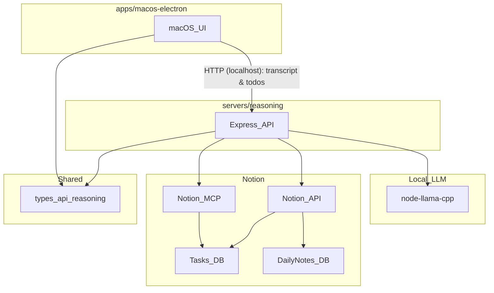

# Repository Architecture

## Overview

This monorepo provides:

- A **macOS Electron client** for pasting transcripts, reviewing outputs, and
  editing todo metadata.
- A **reasoning server** that orchestrates local LLM inference + Notion sync.
- Shared **types** for schema validation and client/server compatibility.

## Key Components

- **macOS app**: `apps/macos-electron`
- **reasoning server**: `servers/reasoning`
- **shared API schemas**: `types/src/api/reasoning.ts`

## Data Flow

## Notes / Constraints

- **Todo update syncing is in-memory**: the server stores UI edits (status,
  priority, etc.) in a process-local map. If the server restarts, pending edits
  are lost.
- **Notion matching searches only Tasks DB**: search results are filtered to
  only include pages whose `parent.database_id` matches the configured Tasks
  database.
