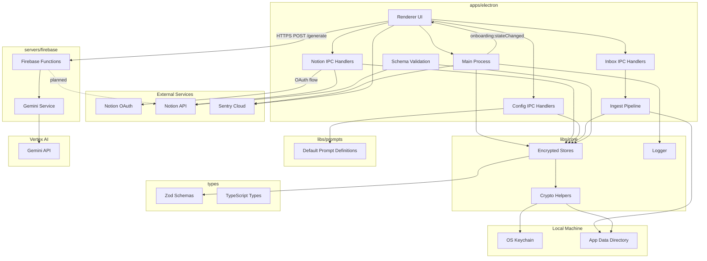

# Repository Architecture

## Overview

This monorepo provides:

- An **Electron desktop client** with Notion integration, onboarding, and local
  encrypted persistence
- A **Firebase server** with a `/generate` endpoint for server-mediated LLM calls (Phase 6)
- Shared **types** and **core utilities** for schema validation, storage, and
  logging

## Key Components

- **Electron app**: `apps/electron` - Desktop client with Notion integration
- **Firebase server**: `servers/firebase` - Functions with `/generate` API (Gemini + parser)
- **Core utilities**: `libs/core` - Logging, run IDs, encrypted storage
- **Shared types**: `types` - Zod schemas and TypeScript types
- **Integrations**: `libs/integrations` - Integration configuration types

## Current Implementation Status

### ✅ Implemented (Phase 1-5)

- Electron desktop app with React UI
- Notion OAuth flow and token management
- Notion database creation and schema validation
- Encrypted local storage (tokens + config)
- Onboarding flow with state management
- Sentry crash reporting and logging
- Config IPC + renderer config UI for preprocess and prompt overrides
- Default prompt definitions packaged in `@flwst/prompts`
- Inbox ingestion pipeline with local artifact persistence

### ✅ Implemented (Phase 6)

- Firebase Functions: POST `/generate` endpoint
- Request validation with `GenerateRequestSchema`, response with `GenerateResponseSchema`
- Vertex AI Gemini integration; fenced-block parser for daily note and task feed
- Request/response logging and token usage in metadata

### 🚧 Planned (Phase 7+)

- Server-side Notion sync

## Data Flow

## Notion Integration Architecture

### Resource Model

The app creates three core Notion resources during onboarding:

1. **Flow State Page**: Parent page containing all resources
2. **Daily Notes Database**: Database for daily note entries
   - Properties: Name, Date, Summary, Tags, Tasks (relation)
3. **Tasks Database**: Database for tasks/todos
   - Properties: Name, Project, Description, Priority, Status, Tags, Due Date,
     Assignee, Source Run ID, Daily Notes (relation)

### Data Source IDs

The Notion API (2025-09-03 version) manages database schemas through
`data_source_id` rather than `database_id`:

1. **Database Creation**: `databases.create()` creates a database with only the
   title property
2. **Data Source Resolution**: After creation, the primary `data_source_id` is
   resolved
3. **Schema Updates**: All property additions/modifications use
   `dataSources.update()` with `data_source_id`
4. **Persistence**: `data_source_id`s are stored in encrypted storage for future
   operations

### Schema Validation

On app startup, the main process automatically:

1. Checks if Notion onboarding is complete (OAuth + resources created)
2. Retrieves stored `data_source_id`s from encrypted storage
3. Fetches current schemas from Notion API
4. Compares expected properties vs actual properties
5. Automatically adds missing properties via `dataSources.update()`

This ensures databases maintain correct schemas through:

- App updates with new required properties
- Manual property deletions by users
- Schema migrations

### Storage Architecture

Two encrypted stores manage state:

#### TokensStore (Sensitive Data)

- `notionAccessToken`: OAuth access token
- `notionDailyNotesDataSourceId`: Daily Notes data source ID
- `notionTodosDataSourceId`: Tasks data source ID

#### ConfigStore (Application State)

- `notion.flowStatePageId`: Parent page ID
- `notion.dailyNotesDataSourceId`: Data source ID
- `notion.todosDataSourceId`: Data source ID
- `onboardingState.notion`: Onboarding progress and metadata

Both stores use `keytar` for OS keychain integration and encrypted file storage.

## Development Patterns

### Type Safety

- All data structures defined with Zod schemas in `types` package
- Runtime validation at storage and API boundaries
- TypeScript for compile-time type checking

### Error Handling

- Custom `NotionError` class with typed error codes
- Comprehensive logging via `@flwst/core` logger
- Sentry integration for crash reporting

### IPC Communication

- Main process exposes handlers for Notion operations
- Renderer process communicates via typed IPC channels
- State updates flow unidirectionally (renderer → main → storage)
- Main process pushes onboarding state changes to the renderer for rehydration

## Future Architecture (Phase 7+)

- **Notion sync**: Server-side Notion database synchronization (client currently
  uses Notion API directly)
