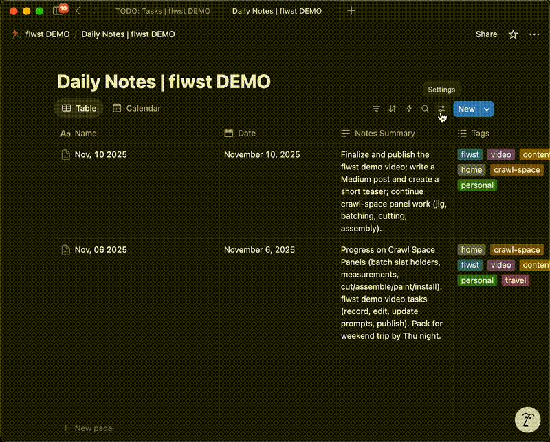

# flwst

flow state: AI workflow to get your mind in order so you flow through your day.

Neat. What does it do?

`flwst` is grouping of prompts, how-tos, and scripts to go from thinking to process management to execution without you having to do a lot of time consuming PM work (make tickets, update statuses, etc.)

The initial integration targets:

- Input from Voice Notes transcript
- Processing of raw input via canned prompts
- Generating and updating of tasks in Notion via MCP

## structure

- `apps/`: UI applications (e.g., macOS Electron app).
- `servers/`: Backend services.
  - `reasoning/`: State-machine driven LLM orchestration engine.
- `libs/`: Shared logic and utilities.
- `types/`: Shared TypeScript type definitions.
- `inbox/`: all your incoming tasks, voice notes, images, etc.
- `prompts/`: all your the canned prompts for the AI to process the inbox.
- `config/`: all your the configuration for the AI to use.
  - Note: Not tracked by git (except the `config/examples/` directory).
- `tmp/`: all your the temporary files for the AI to use.
  - Note: Not tracked by git.
- `archive/`: all your the archived files for the AI to use.
  - Note: Not tracked by git.

## Reasoning Server Architecture

The reasoning server (`servers/reasoning`) uses a linear, enum-driven state machine to orchestrate complex LLM pipelines.

### Execution States

- `INIT`: Server initialization, **transcript pre-processing (spelling & blacklist filtering)**, and Notion context retrieval.
- `DAILY_NOTES_EXTRACTED`: High-level summary and potential tasks extracted.
- `TODOS_EXTRACTED`: Detailed structured todos generated and project-mapped.
- `TODOS_MATCHED`: Todos fuzzy-matched against existing Notion tasks.
- `TODOS_AUGMENTED`: Matched task bodies updated; unmatched tasks refined with project context.
- `NOTION_UPDATED`: Tasks created/updated in Notion and linked to Daily Note.
- `DONE`: Pipeline successfully completed.

### Key Features

- **TDD Driven**: Fully testable via dependency injection (LLM and Notion clients).
- **Local Inference**: Uses `node-llama-cpp` for local, private LLM execution.
- **Project Awareness**: Automatically maps tasks to existing Notion projects using fuzzy matching and LLM refinement.
- **Post-Match Augmentation**: Enriches matched tasks by merging new transcript info with existing Notion content.

## setup

### Notion MCP

This project uses the official [Notion MCP Server](https://github.com/makenotion/notion-mcp-server) via `mcp-remote`.

1.  **Dependencies**:

    ```bash
    cd servers/reasoning
    pnpm install
    pnpm build
    ```

2.  **Authentication**:
    Start the reasoning server:
    ```bash
    pnpm start
    ```
    On the first run, the server will print an **Authorization URL** to the console. Open this URL in your browser to authorize the application with your Notion workspace. Subsequent runs will use the cached credentials.

### Notion Databases

Get the database IDs from the Notion database settings and paste them into the `config/notion.ts` file. Optional but highly recommended as it will cut down on the number of API calls and improve performance.



#### Daily Notes

- `Name`: The name of the daily note.
- `Date`: The date of the daily note.
- `Summary`: A high level summary of the daily note.
- `Tags`: A list of tags to group daily notes.
- `Tasks`: Relation to the Tasks Page that task is from or referenced in (Many to Many relationship)

#### Tasks

- `Name`: The name of the task.
- `Project`: The project the task is associated with (optional)
- `Description`: The description of the task.
- `Priority`: The priority of the task.
- `Status`: The status of the task.
- `Tags`: A list of tags to group tasks (optional)
- `Due Date`: The due date of the task (optional)
- `Assignee`: The assignee of the task (optional)
- `Daily Notes`: Relation to the Daily Notes Page that task is from or referenced in (Many to Many relationship)

### configs

Copy the `config/examples/` directory to `config/` and edit the files as needed.

- `config/notion.ts`: Update the names of various Notion databases and properties.
- `config/spelling.ts`: Map common transcript errors (e.g., "Rio" → "RIOS") to correct values.
- `config/blacklist.ts`: Define regex patterns for non-work content (e.g., "talking to dog") that should be stripped before LLM analysis.

## Usage

1. Capture your thoughts (voice memo, typed notes, etc.) and place the transcript inside `inbox/`.
2. Run the `/process_inbox` command:
   - Confirm each checkpoint with `yes`, pause to make manual edits and reply `fixed`, or abandon with `quit`.
   - The command generates a high-level `tmp/daily_note.md` plus `tmp/tasks/{task}/DRAFT.md`/`REVIEW.md` folders so you can review every artifact before it touches Notion.
   - The Daily Note stays narrative-only; once Tasks are written to Notion, the `## TODOs` section is replaced with a small table that links directly to each Task page (no duplicated acceptance criteria).
   - Tasks are created or updated in Notion **before** the Daily Note so the final note can link to every task using the shared `[[Task Handle]]` placeholders.
   - Expect a final success message summarizing the Daily Note link, created/updated task links, and the archive path (e.g., `archive/2025-01-01/`).
3. (Optional) Run `/list_daily` to spot-check recent Daily Notes or confirm links.
