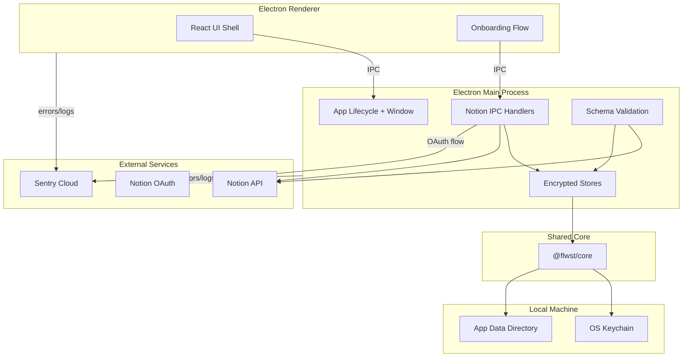
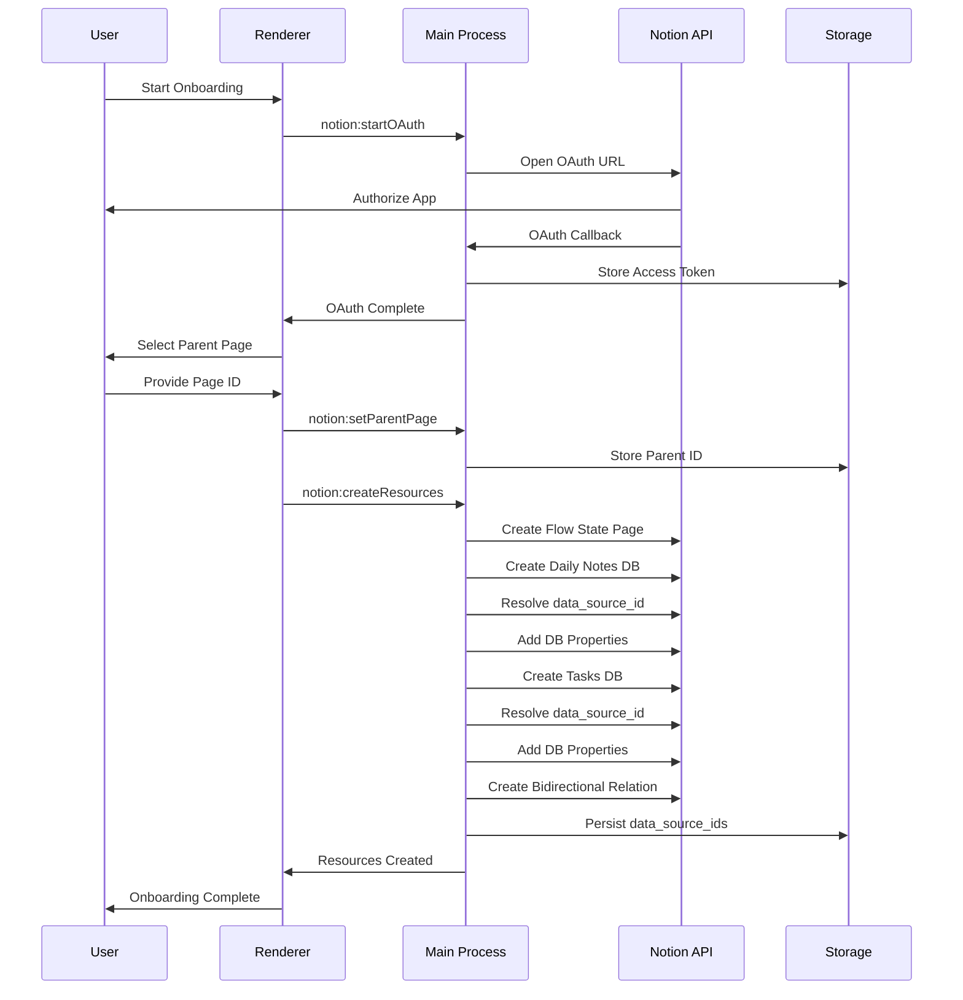

# @flwst/electron Architecture

## Overview

The Electron app is the primary alpha client. It combines a main process that
owns lifecycle, encrypted local persistence, Notion integration, and crash
reporting with a React renderer that hosts the UI shell and onboarding flow.

## Key Responsibilities

- Bootstrap the Electron lifecycle and window management
- Initialize encrypted local storage (tokens + config)
- Handle Notion OAuth flow and manage access tokens
- Create and validate Notion database schemas (using data sources API)
- Provide a renderer UI shell for onboarding and workflow surfaces
- Report crashes and logs to Sentry when configured

## Dependencies

- `@flwst/core` for logging, run IDs, and encrypted storage utilities
- `@flwst/types` for shared type definitions and Zod schemas
- `@notionhq/client` for Notion API interactions
- `@sentry/electron` for crash reporting
- `keytar` for OS keychain integration

## Notion Integration

The app uses the Notion API (2025-09-03 version) to create and manage databases:

### Resource Model

- **Flow State Page**: Parent page containing all resources
- **Daily Notes Database**: Database for daily note entries
- **Tasks Database**: Database for tasks/todos with bidirectional relation to
  Daily Notes

### Data Source IDs vs Database IDs

Starting with the Notion API 2025-09-03 version, database schemas are managed
through `data_source_id` rather than `database_id`. The app:

1. Creates databases via `databases.create()` (which only creates the title
   property)
2. Resolves the primary `data_source_id` for each database
3. Updates schemas via `dataSources.update()` using `data_source_id`
4. Stores `data_source_id` in persistent storage for future schema validation

### Schema Validation Flow

On app startup, the main process:

1. Checks if user has completed Notion onboarding (OAuth + resource creation)
2. Retrieves stored `data_source_id`s from encrypted storage
3. Fetches current schema from Notion for each database
4. Compares expected properties vs actual properties
5. Automatically adds missing properties via `dataSources.update()`

This ensures databases always have the correct schema even if:

- The app is updated with new required properties
- The user manually deletes properties in Notion
- Schema migrations are needed

## Data Flow

## Onboarding Flow

The onboarding flow guides users through Notion setup:

## Storage Architecture

The app uses two encrypted stores:

### TokensStore

Stores sensitive authentication data:

- `notionAccessToken`: OAuth access token
- `notionDailyNotesDataSourceId`: Data source ID for Daily Notes
- `notionTodosDataSourceId`: Data source ID for Tasks

### ConfigStore

Stores application configuration and state:

- `notion.flowStatePageId`: Parent page ID
- `notion.dailyNotesDataSourceId`: Data source ID (redundant with tokens)
- `notion.todosDataSourceId`: Data source ID (redundant with tokens)
- `onboardingState.notion`: Onboarding progress and metadata

Both stores use `keytar` for OS keychain integration and encrypted file storage.
