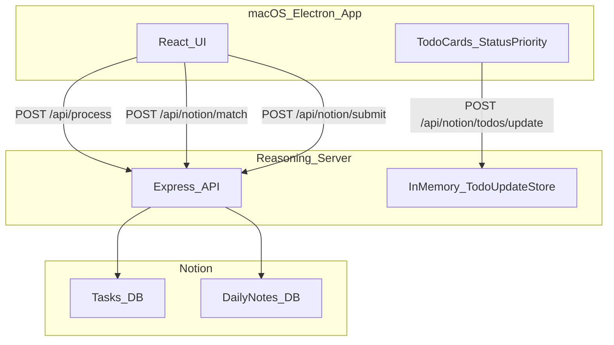

# macOS Electron App Architecture

## Overview

The macOS Electron app is the primary UI for pasting transcripts, reviewing
LLM-generated outputs, editing todo metadata (status/priority), and submitting
results to Notion via the reasoning server.

## Key Responsibilities

- Collect transcript input
- Display daily note markdown + todo list
- Allow inline edits to todo metadata (Status/Priority)
- Sync edits to the reasoning server so Submit uses consistent state
- Trigger submission to Notion (create/update)

## Dependencies

- **UI**: Tamagui
- **Backend**: `servers/reasoning` (HTTP)
- **Schemas**: `@flwst/types` (`types/src/api/reasoning.ts`)

## Data Flow

## Notes / Constraints

- The server-side todo update store is **in-memory**. If the server restarts
  before submit, pending UI edits are lost.
