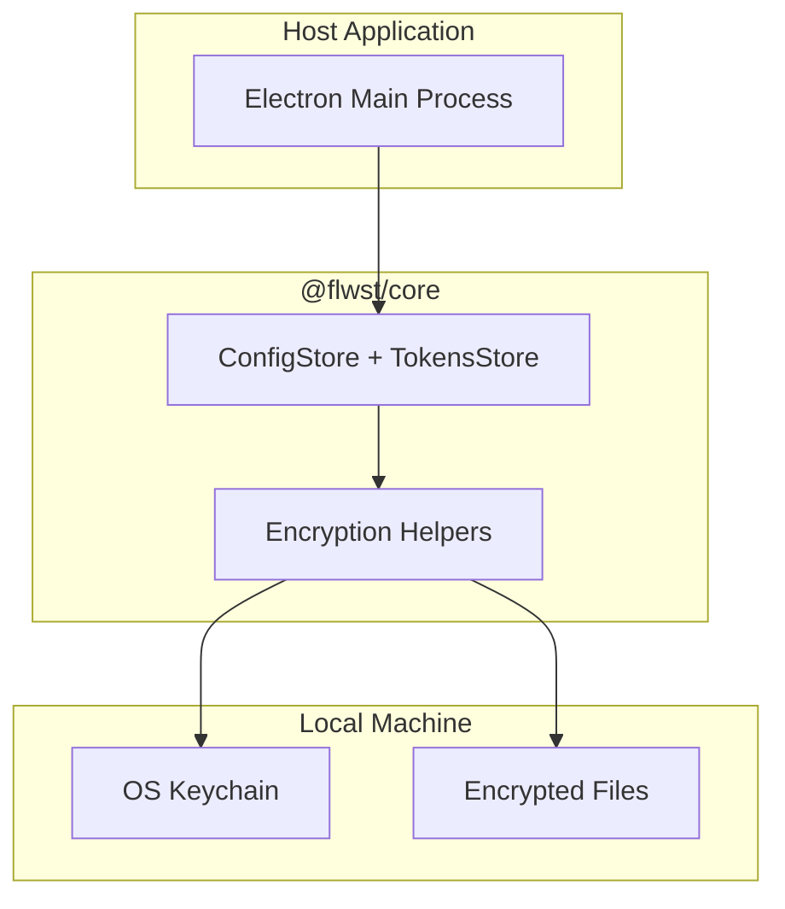

# @flwst/core Architecture

## Overview

The core library provides shared runtime utilities. Its most critical role in
the alpha is encrypted local storage for config and tokens, backed by the OS
keychain and local disk.

## Key Responsibilities

- Provide deterministic run ID generation.
- Offer structured logging with optional external sinks.
- Encrypt/decrypt sensitive data at rest.
- Store config (including prompt overrides) and token data on disk safely.

## Dependencies

- Node.js crypto APIs
- Keychain adapter (e.g., `keytar`) supplied by the host app

## Data Flow

