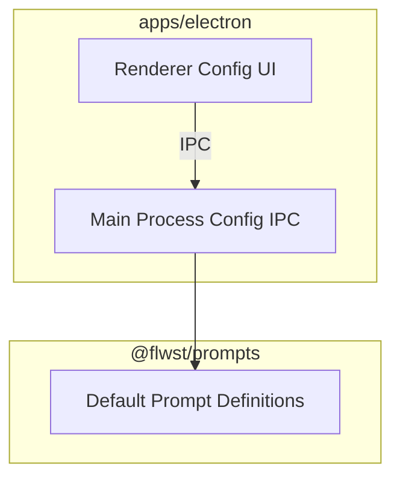

# @flwst/prompts Architecture

## Overview

The prompts package is the single source of truth for default AI prompt
templates used by the Electron client. It ships versioned definitions that the
app can override via local configuration.

## Key Responsibilities

- Define prompt metadata (key, title, version, template).
- Keep defaults in code so apps can render and reset to defaults.
- Avoid runtime templating logic; templates are plain text.

## Dependencies

- None. This package is pure TypeScript and has no runtime integrations.

## Data Flow

