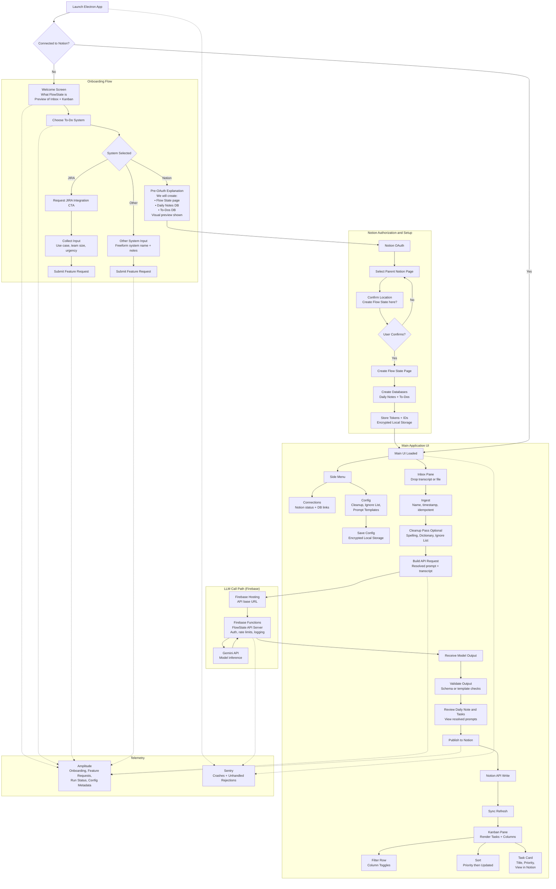
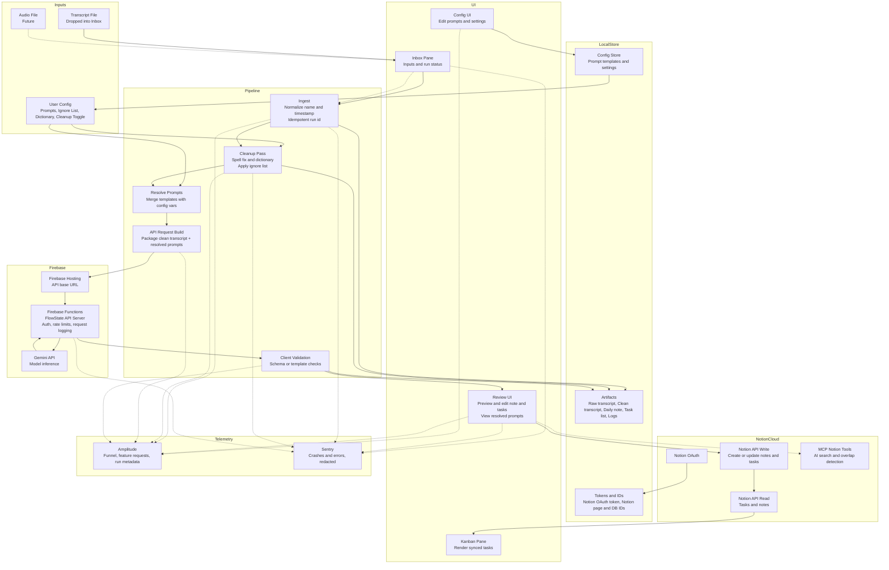

# Diagrams

## App Flow

## Data flow

# **Alpha Definition**

## **Goal**

Ship a reliable, dogfoodable alpha that replaces the current Cursor flow and can be used daily with minimal babysitting. Optimize for determinism, transparency, fast feedback, **and secure LLM access via a server-managed architecture**.

## **MVP Scope (Alpha) — Server & LLM Architecture**

### **LLM Access Model**

- Client applications **do not call an LLM provider directly**
- All LLM requests are routed through a **FlowState-managed API server**
- The server:
  - Owns and protects all LLM API keys
  - Handles basic auth, rate limiting, and request validation
  - Logs request metadata only (no raw transcripts or prompts by default)
  - Provides a stable contract between client apps and the LLM provider

### **Hosting & Infrastructure**

- **Firebase Hosting + Firebase Functions** used for:
  - FlowState API server endpoints
  - LLM request orchestration
  - Secure environment variable and secret management
- Firebase chosen to:
  - Avoid distributing secrets in client apps
  - Minimize operational overhead during alpha
  - Align with analytics, crash reporting, and future auth needs

### **LLM Provider**

- **Gemini (via Firebase)** is the default LLM provider for alpha
- Model choice is abstracted behind the server and is not client-coupled
- Client sends to server:
  - Cleaned transcript
  - Resolved prompt(s)
  - Minimal run metadata
- Server returns:
  - Structured Daily Note output
  - Structured Task List output

## **Core Workflow (Golden Path) — Updated**

1. **Ingest**
   - Transcript or file dropped into Inbox
   - Deterministic naming + timestamps
   - Idempotent run ID
2. **Cleanup Pass (Client-Side, Configurable)**
   - Second-pass transcript cleanup
   - Fix common mistranscriptions
   - Apply ignore / blacklist phrases
   - Produce clean_transcript
3. **LLM Generation (Server-Mediated)**
   - Client resolves prompts locally (after user config)
   - Client sends clean_transcript + resolved prompts to FlowState API server
   - Server forwards request to Gemini
   - Server returns model outputs
4. **Validation**
   - Client validates outputs against schemas/templates
   - Fail loudly on invalid output
5. **Review**
   - User can view/edit generated notes and tasks
   - User can view the exact resolved prompts used for generation
6. **Publish**
   - Write Daily Notes + Tasks to Notion databases

## **Security & Trust Guarantees (Alpha)**

- LLM API keys **never ship to client applications**
- All sensitive local data stored **encrypted at rest**:
  - OAuth tokens
  - Notion database and page IDs
  - Prompt edits
  - Config state
- Server-side logging is limited to:
  - Timing
  - Success/failure
  - Model identifiers
- Raw transcripts and prompts are **not persisted server-side by default**

## **Explicit Non-Goals (Alpha) — Server & Infra**

- Multi-tenant user auth beyond basic API protection
- User-level billing, quotas, or rate plans
- Multiple user-selectable LLM providers
- Fine-grained per-user server configuration

## **Definition of Done (Alpha)**

- Installable Electron app
- Deterministic, replayable pipeline
- Prompt transparency + editable config
- Server-mediated LLM access via Firebase + Gemini
- Notion sync working end-to-end
- Encrypted local storage for all sensitive data
- Analytics + crash reporting live
- Usable daily without manual intervention

# Development Plan

## **Phase 0 — Prerequisites and Human Setup (Manual)**

**Owner:** Human

**Goal:** Unblock development by setting up external services and credentials that cannot be automated.

- Create Firebase project
  - Enable Firebase Hosting
  - Enable Firebase Functions
  - Set up project environments (dev initially)
- Enable Gemini access via Firebase
- Create and store environment variables in Firebase
  - Gemini API credentials
  - Any server-side secrets
- Create Notion integration
  - Register Notion OAuth app
  - Capture client ID / secret
  - Define required scopes
- Decide initial Notion database schemas
  - Daily Notes properties
  - To-Dos properties (status, priority, timestamps)
- Create Sentry project
- Create Amplitude project
- Decide naming conventions for:
  - Flow State page
  - Databases
  - Status values
  - Priority scale

Deliverable:

- All credentials available
- Schemas decided
- Firebase project live

## **Phase 1 — Repo + Architecture Scaffolding**

**Owner:** Cursor

**Goal:** Establish the monorepo and shared foundations.

- Initialize monorepo structure
  - apps/electron
- apps/mobile (stub only)
  - types
  - libs/core
  - libs/ui
  - libs/integrations
  - config
- Set up TypeScript project references
- Add Zod and define:
  - Core data models
  - Config schema
  - Artifact schema
- Add Tamagui base configuration
- Add Zustand store scaffolding
- Add shared utilities for:
  - File paths
  - Run IDs
  - Logging
- Add placeholder README for repo structure

Deliverable:

- Buildable monorepo
- Shared types compiling
- No app logic yet

## **Phase 2 — Electron App Shell + Local Storage**

**Owner:** Cursor

**Goal:** Get a real app running with secure local persistence.

- Create Electron app shell
  - Window management
  - App lifecycle
- Implement encrypted local storage
  - App cache directory
  - Encryption helper utilities
- Store and retrieve:
  - OAuth tokens
  - Notion IDs
  - User config
- Add basic navigation layout
  - Main window
  - Side menu placeholder
- Integrate Sentry (Electron main + renderer)

Deliverable:

- Installable Electron app
- Encrypted local storage working
- Crash reporting live

## **Phase 3 — Onboarding Flow + Notion Setup**

**Owner:** Cursor

**Goal:** Complete first-run experience end-to-end.

- Welcome screen
  - Explain FlowState
  - Preview Inbox + Kanban
- System selection screen
  - Notion
  - JIRA (CTA only)
  - Other system freeform input
- JIRA / Other system
  - Feature request submission
  - Amplitude tracking
- Notion pre-OAuth explanation screen
  - Visual representation of pages/databases to be created
- Notion OAuth flow
- Parent page selection
- Confirmation screen before mutation
- Create Flow State page
- Create Daily Notes and To-Dos databases
- Persist Notion IDs securely
- Post-onboarding redirect to main UI

Deliverable:

- Clean first-run flow
- Notion setup without surprises
- Feature request data flowing

---

## **Phase 4 — Config System + Prompt Management**

**Owner:** Cursor

**Goal:** Make prompts and cleanup fully transparent and editable.

- Build Config UI
  - Cleanup toggle
  - Ignore list editor
  - User dictionary editor
- Prompt editors
  - Daily Note prompt
  - Task List prompt
  - Cleanup prompt
- Show resolved prompts
- Enforce prompt validation
  - Required placeholders
  - Non-empty constraints
- Save config edits to encrypted local storage
- Restore defaults functionality

Deliverable:

- Fully user-editable prompt pipeline
- Deterministic config behavior

---

## **Phase 5 — Inbox Pane + Client Pipeline**

**Owner:** Cursor

**Goal:** Process transcripts deterministically on the client.

- Build Pane component
  - Title bar
  - Collapse behavior
  - Configurable scroll behavior
- Inbox pane
  - File drop
  - Transcript ingest
- Ingest logic
  - Naming
  - Timestamps
  - Idempotent run IDs
- Cleanup pass
  - Apply ignore list
  - Apply dictionary fixes
- Artifact persistence
  - Raw transcript
  - Clean transcript
  - Logs

Deliverable:

- Reliable transcript ingestion
- Debuggable artifact trail

---

## **Phase 6 — Firebase API Server + Gemini Integration**

**Owner:** Cursor (code) + Human (deploy/secrets)

**Goal:** Secure, server-mediated LLM calls.

- Create Firebase Functions project
- Implement FlowState API endpoint
  - Accept transcript + resolved prompts
  - Validate payload
- Integrate Gemini API
- Return structured outputs
- Implement server-side logging
  - Timing
  - Success/failure
- Ensure no raw content persistence
- Deploy to Firebase Hosting
- Configure app to call server endpoint

Deliverable:

- App → Server → Gemini → App loop working
- No LLM keys in client

---

## **Phase 7 — Validation, Review, and Publish**

**Owner:** Cursor

**Goal:** Turn model output into trusted user-facing data.

- Client-side validation
  - Zod schema checks
- Review UI
  - Preview Daily Note
  - Preview Tasks
  - Edit before publish
- Show resolved prompts used
- Publish to Notion
  - Create/update Daily Notes
  - Create/update To-Dos
- Sync refresh after publish

Deliverable:

- Safe write path into Notion
- User trust preserved

---

## **Phase 8 — Kanban Pane + Sync**

**Owner:** Cursor

**Goal:** Make FlowState usable day-to-day.

- Build Kanban Pane
- Fetch tasks via Notion API
- Render columns
- Column visibility toggles
- Horizontal scroll
- Sorting
  - Priority
  - Last updated
- “View in Notion” links

Deliverable:

- Functional task board
- Clear picture of work state

---

## **Phase 9 — Analytics, Polish, and Alpha Hardening**

**Owner:** Cursor + Human

**Goal:** Make alpha usable by others.

- Integrate Amplitude
  - Onboarding funnel
  - Feature requests
  - Run success/failure
- Redact sensitive data
- Error state UX
- Empty state UX
- Build DMG installer
- Smoke test on clean machine
- Select 3–5 alpha users

Deliverable:

- Shippable alpha
- Feedback loop established
