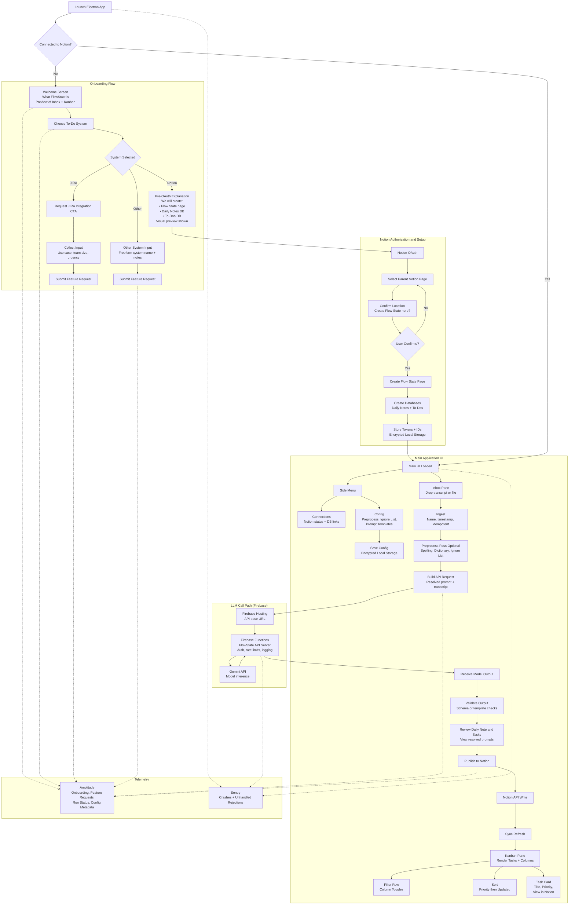

# Diagrams

## App Flow

## Data flow

# **Alpha Definition**

## **Goal**

Ship a reliable, dogfoodable alpha that replaces the current Cursor flow and can
be used daily with minimal babysitting. Optimize for determinism, transparency,
fast feedback, **and secure LLM access via a server-managed architecture**.

## **MVP Scope (Alpha) — Server & LLM Architecture**

### **LLM Access Model**

- Client applications **do not call an LLM provider directly**
- All LLM requests are routed through a **FlowState-managed API server**
- The server:
  - Owns and protects all LLM API keys
  - Handles basic auth, rate limiting, and request validation
  - Logs request metadata only (no raw transcripts or prompts by default)
  - Provides a stable contract between client apps and the LLM provider

### **Hosting & Infrastructure**

- **Firebase Hosting + Firebase Functions** used for:
  - FlowState API server endpoints
  - LLM request orchestration
  - Secure environment variable and secret management
- Firebase chosen to:
  - Avoid distributing secrets in client apps
  - Minimize operational overhead during alpha
  - Align with analytics, crash reporting, and future auth needs

### **LLM Provider**

- **Gemini (via Firebase)** is the default LLM provider for alpha
- Model choice is abstracted behind the server and is not client-coupled
- Client sends to server:
  - Preprocessed transcript
  - Resolved prompt(s)
  - Minimal run metadata
- Server returns:
  - Structured Daily Note output
  - Structured Task List output

## **Core Workflow (Golden Path) — Updated**

1. **Ingest**
   - Transcript or file dropped into Inbox
   - Deterministic naming + timestamps
   - Idempotent run ID
2. **Preprocess Pass (Client-Side, Configurable)**
   - Second-pass transcript preprocess
   - Fix common mistranscriptions
   - Apply ignore / blacklist phrases
   - Produce preprocessed_transcript
3. **LLM Generation (Server-Mediated)**
   - Client resolves prompts locally (after user config)
   - Client sends preprocessed_transcript + resolved prompts to FlowState API server
   - Server forwards request to Gemini
   - Server returns model outputs
4. **Validation**
   - Client validates outputs against schemas/templates
   - Fail loudly on invalid output
5. **Review**
   - User can view/edit generated notes and tasks
   - User can view the exact resolved prompts used for generation
6. **Publish**
   - Write Daily Notes + Tasks to Notion databases

## **Security & Trust Guarantees (Alpha)**

- LLM API keys **never ship to client applications**
- All sensitive local data stored **encrypted at rest**:
  - OAuth tokens
  - Notion database and page IDs
  - Prompt edits
  - Config state
- Server-side logging is limited to:
  - Timing
  - Success/failure
  - Model identifiers
- Raw transcripts and prompts are **not persisted server-side by default**

## **Explicit Non-Goals (Alpha) — Server & Infra**

- Multi-tenant user auth beyond basic API protection
- User-level billing, quotas, or rate plans
- Multiple user-selectable LLM providers
- Fine-grained per-user server configuration

## **Definition of Done (Alpha)**

- Installable Electron app
- Deterministic, replayable pipeline
- Prompt transparency + editable config
- Server-mediated LLM access via Firebase + Gemini
- Notion sync working end-to-end
- Encrypted local storage for all sensitive data
- Analytics + crash reporting live
- Usable daily without manual intervention

# Development Plan

**Current Phase:** Phase 5 — Inbox Pane + Client Pipeline (completing)

## **Phase 0 — Prerequisites and Human Setup (Manual)**

### Status: In Progress (manual)

**Owner:** Human

**Goal:** Unblock development by setting up external services and credentials
that cannot be automated.

- Create Firebase project
  - Enable Firebase Hosting
  - Enable Firebase Functions
  - Set up project environments (dev initially)
- Enable Gemini access via Firebase
- Create and store environment variables in Firebase
  - Gemini API credentials
  - Any server-side secrets
- Create Notion integration
  - Register Notion OAuth app
  - Capture client ID / secret
  - Define required scopes
- Decide initial Notion database schemas
  - Daily Notes properties
  - To-Dos properties (status, priority, timestamps)
- Create Sentry project
- Create Amplitude project
- Decide naming conventions for:
  - Flow State page
  - Databases
  - Status values
  - Priority scale

Deliverable:

- All credentials available
- Schemas decided
- Firebase project live

## **Phase 1 — Repo + Architecture Scaffolding**

### Status: ✅

**Owner:** Cursor

**Goal:** Establish the monorepo and shared foundations.

- Initialize monorepo structure
  - apps/electron
- apps/mobile (stub only)
  - types
  - libs/core
  - libs/ui
  - libs/integrations
  - config
- Set up TypeScript project references
- Add Zod and define:
  - Core data models
  - Config schema
  - Artifact schema
- Add Tamagui base configuration
- Add Zustand store scaffolding
- Add shared utilities for:
  - File paths
  - Run IDs
  - Logging
- Add placeholder README for repo structure

Deliverable:

- Buildable monorepo
- Shared types compiling
- No app logic yet

## **Phase 2 — Electron App Shell + Local Storage**

### Status: ✅

**Owner:** Cursor

**Goal:** Get a real app running with secure local persistence.

- Create Electron app shell
  - Window management
  - App lifecycle
- Implement encrypted local storage
  - App cache directory
  - Encryption helper utilities
- Store and retrieve:
  - OAuth tokens
  - Notion IDs
  - User config
- Add basic navigation layout
  - Main window
  - Side menu placeholder
- Integrate Sentry (Electron main + renderer)

Deliverable:

- Installable Electron app
- Encrypted local storage working
- Crash reporting live

## **Phase 3 — Onboarding Flow + Notion Setup**

### Status: ✅

**Owner:** Cursor

**Goal:** Complete first-run experience end-to-end.

### Implementation Details

**Onboarding Flow States:**

- `Welcome` - Explain FlowState and preview Inbox + Kanban
- `SystemSelect` - User chooses Notion, JIRA (CTA), or Other
- `FeatureRequest` - Collect use case, team size, urgency for JIRA/Other
- `NotionExplain` - Visual representation of pages/databases to be created
- `NotionOAuthStart` - Initiate OAuth flow (opens external browser)
- `NotionOAuthComplete` - OAuth result confirmation
- `ParentSelect` - User selects parent page for resources
- `ConfirmCreate` - Confirmation screen before mutation
- `CreateResources` - Create Flow State page, Daily Notes DB, To-Dos DB
- `Done` - Completion state
- Escape states: `CancelConfirm`, `Error`, `Busy`

**Notion Status Enum:**

- `disconnected` -> `oauth_pending` -> `authed` -> `parent_selected` ->
  `resources_created` -> `ready` (or `error`)

**Onboarding Gate:**

- App shows onboarding if `!onboardingCompleted || notion.status !== 'ready'`
- `ready` means: OAuth result present (access token in main + workspace metadata
  in state) + parent page selected + resources created (DB IDs present)

**Re-entry Conditions:**

- Fresh install (no onboarding state)
- Storage reset
- User clicks "Reset onboarding" (future)
- Missing/invalid Notion state (token expired, DB IDs missing)

**IPC Surface:**

- `onboarding.getState()` - Get current onboarding state
- `onboarding.updateState(partial)` - Update onboarding state (authoritative)
- `notion.startOAuth()` - Start OAuth flow (stub in Phase 3)
- `notion.storeOAuthResult(...)` - Store OAuth result (stub in Phase 3)
- `notion.setParentPage(...)` - Set parent page ID
- `notion.createResources(...)` - Create Notion resources (stub in Phase 3)

**Feature Request Persistence:**

- Stored locally in onboarding state (no network blocking in Phase 3)
- Optional telemetry integration in future phases

Deliverable:

- Clean first-run flow with all screens implemented
- Notion setup without surprises (OAuth stubbed, resources creation stubbed)
- Feature request data persisted locally
- Onboarding state persisted in encrypted storage
- App correctly gates between onboarding and main UI

---

## **Phase 4 — Config System + Prompt Management**

### Status: ✅

**Owner:** Cursor

**Goal:** Make prompts and preprocess fully transparent and editable.

**Done:**

- **libs/prompts** (`@flwst/prompts`) — source of truth for default prompt templates (dailyNote, taskDraft); templates in code, no runtime .md reads.
- **Config schema** — preprocess (toggle, ignore list, dictionary); prompts are overrides only (dailyNote?, taskDraft?); defaults live in @flwst/prompts.
- **ConfigStore** — preprocess + empty prompts by default; parse migrates cleanup→preprocess, taskList→taskDraft.
- **Config IPC + preload** — config:read, config:update, config:resetPrompt, config:getEffectivePrompts, config:getPromptDefaults; api.config exposed to renderer.
- **Config UI** — SideMenu: flwst title, Preprocess On/Off, Daily Note / Task Draft selection; MainPane: preprocess toggle, prompt editors (default read-only, effective editable, Reset to default, Save override).
- **Electron vite** — @flwst/prompts resolved to src (no dist); bundled with main/preload.

**Remaining (optional):**

- Ignore list / Dictionary editors in UI (preprocess toggle only for now).
- Resolved prompt preview (e.g. with runtime vars) if needed later.

Deliverable:

- Fully user-editable prompt pipeline
- Deterministic config behavior

---

## **Phase 5 — Inbox Pane + Client Pipeline**

### Status: ✅

**Owner:** Cursor

**Goal:** Process transcripts deterministically on the client.

- ✅ Build Pane component
  - ✅ Title bar
  - ✅ Collapse behavior (SettingsRail)
  - ✅ Configurable scroll behavior
- ✅ Inbox pane
  - ✅ File drop
  - ✅ Transcript ingest
- ✅ Ingest logic
  - ✅ Naming
  - ✅ Timestamps
  - ✅ Idempotent run IDs
- ✅ Preprocess pass
  - ✅ Apply ignore list
  - ✅ Apply dictionary fixes
- ✅ Artifact persistence
  - ✅ Raw transcript
  - ✅ Preprocessed transcript
  - ✅ Logs

Deliverable:

- Reliable transcript ingestion
- Debuggable artifact trail

---

## **Phase 6 — Firebase API Server + Gemini Integration**

**Owner:** Cursor (code) + Human (deploy/secrets)

**Goal:** Secure, server-mediated LLM calls.

### Status: ⚠️ Needs env vars + redeploy

- ✅ Create Firebase Functions project
- ✅ Implement FlowState API endpoint
  - ✅ Accept transcript + resolved prompts
  - ✅ Validate payload
- ✅ Integrate Gemini API (Vertex AI)
- ✅ Return structured outputs
- ✅ Implement server-side logging
  - ✅ Timing
  - ✅ Success/failure
- ✅ Ensure no raw content persistence
- ✅ Deploy to Firebase Hosting
- ✅ Configure app to call server endpoint
- ✅ Set runtime env vars in Functions and redeploy:
  - `GOOGLE_CLOUD_PROJECT`
  - `GOOGLE_CLOUD_LOCATION=global`
  - `GOOGLE_GENAI_USE_VERTEXAI=true`

Deliverable:

- App → Server → Gemini → App loop working
- No LLM keys in client

---

## **Phase 6.b — Client LLM Wiring**

**Owner:** Cursor

**Goal:** Connect the client pipeline to the deployed FlowState API.

### Status: ✅

- ✅ Add LLM call step after preprocess in client pipeline
- ✅ Send preprocessed transcript + resolved prompts to server
- ✅ Store returned outputs as artifacts
- ✅ Surface run status and failures in UI

Deliverable:

- Client can call server endpoint and receive outputs
- End-to-end run completes without manual steps

---

## **Phase 7 — Notion Sync + Dedup Gate (Pre-Publish)**

Owner: Cursor

Goal: Make Notion the system of record inside the app: pull Tasks + Daily Notes into local state on launch and via Sync, then use a DB-scoped dedup gate (API snapshot + MCP) before creating/updating tasks.

7.0 Guardrails (pulled from PR #2, adapted)

DB-scoped only (hard requirement)
Any “search-like” result must be filtered to pages whose parent.type === 'database_id' and whose parent.database_id matches the configured Tasks DB. PR #2 had to harden this because Notion search/MCP results can return pages without parent or with unexpected parent types, and it used cached API pages to recover when results were missing parent metadata. 

Policy:
• Only trust:
• pages fetched directly from databases.query(tasksDbId) (canonical snapshot)
• MCP results only if they can be reconciled against the canonical snapshot (same page id)
• Never allow workspace-wide MCP search (even accidentally)

7.1 Bootstrap Sync on App Launch

When: App launches and notion.status === 'ready'

What:
• databases.query(DailyNotesDbId) → hydrate daily notes store
• databases.query(TasksDbId) → hydrate tasks store
• Persist minimal sync metadata:
• lastSyncAt
• counts (tasks/notes)
• lastError (optional)
• (optional later) ETag-ish “since” state if you move to incremental

State shape (example):

type NotionSyncState = {
lastSyncAt?: string; // ISO
isSyncing: boolean;
lastError?: { message: string; at: string } | null;

tasksById: Record<string, NotionTask>;
notesById: Record<string, NotionDailyNote>;
};

7.2 Manual Sync Button (Top Right)

Add a dedicated Sync button (top right) that:
• disables while in-flight
• shows a clear “syncing…” state
• updates lastSyncAt on success
• surfaces errors without crashing the app

PR #2 used the same basic UI pattern for “Refresh Kanban” and disabled it while refresh was running; copy the interaction model. 

UI contract (example):

async function syncNow(): Promise<void> {
if (syncState.isSyncing) return;
setSyncState((s) => ({ ...s, isSyncing: true, lastError: null }));

try {
const [tasks, notes] = await Promise.all([fetchTasksDb(), fetchNotesDb()]);
hydrateStores({ tasks, notes });
setSyncState((s) => ({ ...s, isSyncing: false, lastSyncAt: new Date().toISOString() }));
} catch (err) {
setSyncState((s) => ({
...s,
isSyncing: false,
lastError: { message: String(err), at: new Date().toISOString() },
}));
}
}

7.3 Normalize Notion ↔ Local Enums (avoid mismatch bugs)

PR #2 added defensive normalization for status/priority before validation because Notion values (and model outputs) drift (“todo” vs “TODO”, “in progress” vs “In Progress”, etc.). Use this in both directions:
• when ingesting model output into drafts
• when reading Notion tasks into local state
• when preparing payloads for Notion writes

Example normalization (adapted from PR #2): 

function normalizeStatus(status?: string): string | undefined {
if (!status) return undefined;
const normalized = status.trim().toLowerCase();
const mapping: Record<string, string> = {
todo: 'TODO',
'on deck': 'On Deck',
'in progress': 'In Progress',
blocked: 'BLOCKED',
done: 'Done',
cancelled: 'Cancelled',
};
return mapping[normalized];
}

function normalizePriority(priority?: string): string | undefined {
if (!priority) return undefined;
const normalized = priority.trim().toLowerCase();
const mapping: Record<string, string> = {
top: 'TOP',
high: 'High',
medium: 'Medium',
low: 'Low',
'back burner': 'Back burner',
};
return mapping[normalized];
}

7.4 Dedup Gate After Ingest (Before Any Write)

Trigger: After ingest produces a Daily Note artifact + extracted task drafts.

Inputs:
• newDraftTasks[] (from ingestion)
• tasksSnapshot[] (from Notion API sync; canonical)

Outputs (per draft):
• action: 'create' | 'update' | 'skip'
• matchedTaskId?: string
• reason: string (short, deterministic)

Pipeline: 1. Ensure tasks snapshot is present (force tasks-only sync if stale or missing) 2. For each draft task:
• Build a small, targeted candidate set from the snapshot (cheap local heuristics)
• Use MCP to validate overlap only within Tasks DB
• Reconcile MCP “hits” against snapshot by id
• Decide create/update/skip

⸻

7.5 Candidate Prefilter + Query Keyword Hygiene (improves matching reliability)

PR #2 improved matching by prioritizing proper nouns and removing noisy tokens when building search queries. Use this idea to:
• prefilter snapshot candidates
• seed MCP calls with compact keywords
• reduce false positives

Example tokenization / keyword selection (adapted from PR #2): 

const stopWords = new Set([
'the','a','an','and','or','but','to','of','for','with','on','in','at','from','by',
]);

function buildQueryTokens(text: string): string[] {
const rawTokens = text.split(/[\s/]+/);
const normalize = (t: string) => t.toLowerCase().replace(/[^\w]/g, '');
const isCandidate = (t: string) => t.length >= 3 && !stopWords.has(t);

const isProperNoun = (raw: string) => /^[A-Z][a-z]+/.test(raw);

const proper = rawTokens
.map((raw) => ({ raw, norm: normalize(raw) }))
.filter(({ raw, norm }) => isCandidate(norm) && isProperNoun(raw))
.map(({ norm }) => norm);

const general = rawTokens
.map(normalize)
.filter(isCandidate);

// Proper nouns first, then unique general tokens.
const seen = new Set<string>();
const out: string[] = [];
for (const t of [...proper, ...general]) {
if (!seen.has(t)) out.push(t), seen.add(t);
}
return out.slice(0, 12);
}

7.6 DB-Scoped Reconciliation Pattern (MCP results must map to snapshot)

PR #2 explicitly handled cases where search-like results lacked parent or had wrong parents and “recovered” by reusing cached API pages by id. Use the same concept, but invert it for your architecture:
• The snapshot is the authoritative cache (tasksById)
• MCP can return candidate ids, but you only accept them if tasksById[id] exists
• If MCP returns pages missing parent fields, you still accept only if the id is in snapshot

DB-scoping/recovery concept reference: 

Example reconciliation:

function reconcileMcpIdsToSnapshot(
mcpResultIds: string[],
tasksById: Record<string, NotionTask>,
): NotionTask[] {
const out: NotionTask[] = [];
for (const id of mcpResultIds) {
const t = tasksById[id];
if (t) out.push(t); // DB-scoped by construction (from tasks snapshot)
}
return out;
}

7.7 Write Safety: Guard Assignee Updates (avoid invalid payloads)

PR #2 added a guard to only send Notion people: [{ id }] when the input can be normalized into a Notion user id (32 hex chars, hyphens allowed). Use the same guardrail in your Notion write layer. 

function normalizeNotionUserId(input?: string): string | undefined {
if (!input) return undefined;
const normalized = input.trim();
if (!normalized) return undefined;

const hex = normalized.replace(/-/g, '');
if (!/^[0-9a-fA-F]{32}$/.test(hex)) return undefined;

// Notion accepts both hyphenated and non-hyphenated; choose one format consistently.
return hex;
}

function maybeAddAssignee(props: any, assignee?: string) {
if (assignee === undefined) return;

const assigneeId = normalizeNotionUserId(assignee);
if (!assigneeId) {
// Log + skip; do not send invalid person payloads.
return;
}

props.Assignee = { people: [{ id: assigneeId }] };
}

Deliverable (Phase 7)
• App launch performs Tasks + Daily Notes sync into local state
• Sync button refreshes state with safe UI behavior
• Canonical tasks snapshot exists in-memory and drives:
• dedup gating
• Kanban rendering
• Dedup gate uses:
• DB-scoped snapshot + MCP assistance (DB-scoped + reconciled by id)
• keyword hygiene for targeted matching
• Write layer normalizes enums and guards assignee updates

## **Phase 8 — Kanban + Sync-Driven Rendering (No Writes Required)**

Owner: Cursor

Goal: Make FlowState usable daily by rendering Kanban purely from the synced snapshot and wiring refresh behaviors tightly.

8.1 Render Kanban from Synced Tasks Snapshot
• Source of truth: tasksById (from Phase 7 sync)
• Group into columns by normalized status
• Keep rendering independent of ingest/publish path (Kanban works even if user never runs the LLM)

8.2 Column Controls + Sorting
• Column visibility toggles
• Horizontal scroll
• Sorting:
• Priority (normalized)
• Last updated (last_edited_time)

8.3 Refresh UX Patterns (pulled from PR #2)

PR #2 added a “Refresh Kanban” button and disabled it while a refresh was active, plus a loading overlay state; reuse that exact interaction model, but back it with the unified Sync button. 

Rule:
• If syncState.isSyncing === true:
• disable column controls that would produce inconsistent state
• show a small refresh indicator (non-blocking if possible)

8.4 “View in Notion” Link Behavior
• Kanban cards include a “View” action that opens the Notion URL externally
• Must not open in a new Electron window; always route through the safe external opener
• (Implementation detail) guard shell availability and fallback cleanly (PR #2 hardened this path)

Deliverable (Phase 8)
• Kanban board renders from synced tasks snapshot
• Controls: column visibility + sorting
• Sync button refreshes Kanban deterministically
• External Notion links open safely outside the app

## **Phase 9 — Analytics, Polish, and Alpha Hardening**

**Owner:** Cursor + Human

**Goal:** Make alpha usable by others.

- Integrate Amplitude
  - Onboarding funnel
  - Feature requests
  - Run success/failure
- Redact sensitive data
- Error state UX
- Empty state UX
- Build DMG installer
- Smoke test on clean machine
- Select 3–5 alpha users

Deliverable:

- Shippable alpha
- Feedback loop established
