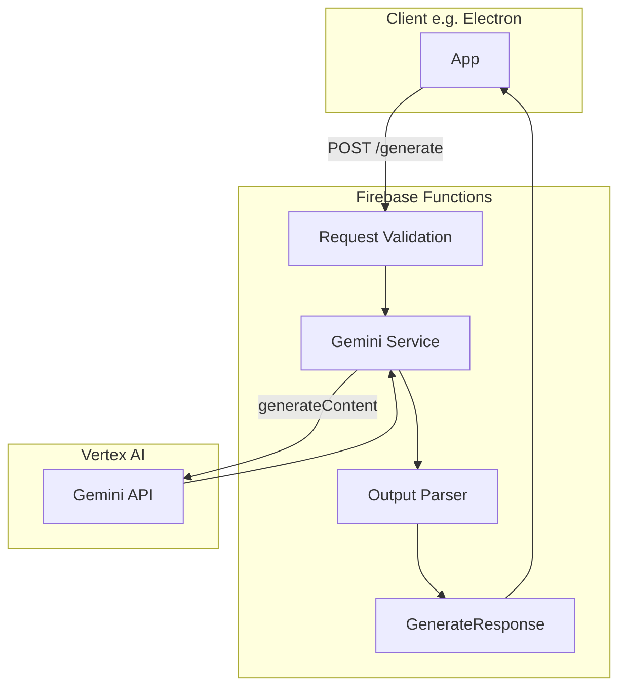

# Firebase Server Architecture

## Overview

The Firebase server is the API layer for server-mediated LLM calls. It runs as
Firebase Functions + Hosting, owns secrets and env config, validates requests
with shared Zod schemas, calls Vertex AI Gemini, and returns structured daily
note and task feed output. Notion sync is planned for a later phase.

## Key Responsibilities

- Expose POST `/generate` for transcript + prompts → daily note + task feed.
- Validate request bodies with `GenerateRequestSchema` from `@flwst/types`.
- Call Vertex AI Gemini (via `@google/genai`) with the daily note prompt and
  transcript.
- Parse model output (fenced `[[DAILY_NOTE*]]` / `[[TASK_FEED*]]` blocks) and
  return `GenerateResponse`-shaped JSON.
- Log requests/responses and token usage; optional Genkit sample callable.

## Dependencies

- Firebase Functions + Hosting
- Vertex AI / Gemini (Phase 6 implemented)
- `@flwst/types` for request/response schemas
- Notion API (planned, not yet implemented)

## Data Flow

Request flow: body → `GenerateRequestSchema` validation → build prompt+transcript
→ `generateContent` → raw text → parser extracts daily note and task feed →
JSON response with `dailyNote`, `taskFeed`, and metadata (model, durationMs,
tokenUsage).
