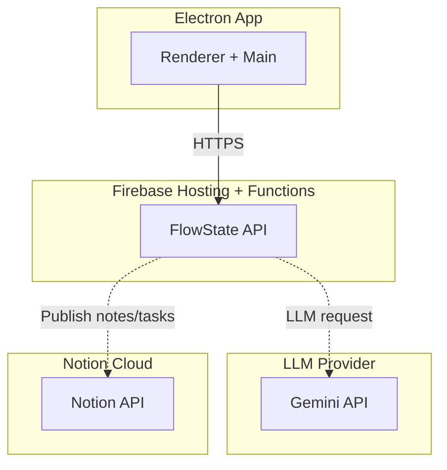

# @flwst/firebase Architecture

## Overview

The Firebase server is the planned API layer for server-mediated LLM calls and
Notion sync. It is scaffolded as Firebase Functions + Hosting and will own
secrets, validation, and request logging.

## Key Responsibilities

- Receive client requests from the Electron app.
- Validate payloads and enforce basic auth/rate limits (Phase 6).
- Call the Gemini API and return structured outputs (Phase 6).
- Write to Notion APIs for notes and tasks (Phase 7).

## Dependencies

- Firebase Functions + Hosting
- Gemini API (planned)
- Notion API (planned)

## Data Flow

