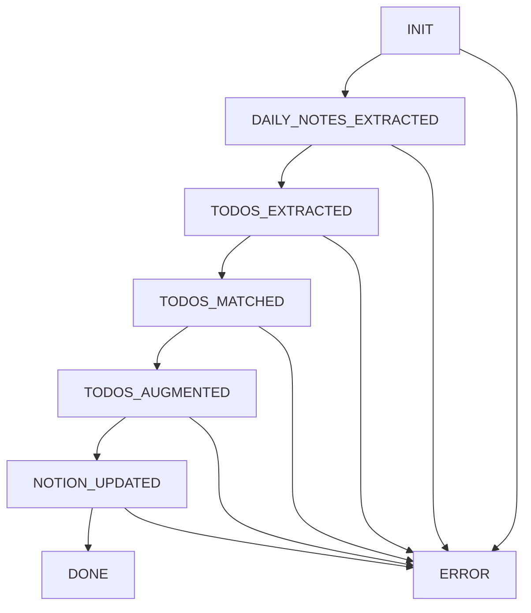
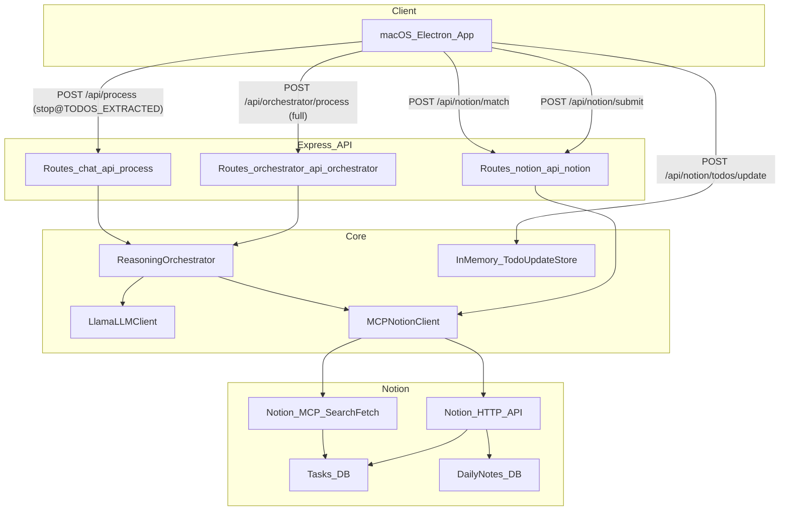

# Reasoning Server Architecture

## Overview

The reasoning server is an Express API that orchestrates a transcript→daily note
and todo pipeline. The core orchestration is implemented as an enum-driven
state machine (`ReasoningOrchestrator`) with dependency-injected LLM + Notion
clients.

## Key Responsibilities

- **Preprocess transcript** (spelling fixes, blacklist handling)
- **Extract daily notes + todos** (local inference)
- **Match todos to Notion Tasks DB**
- **Augment / update** todos and tasks (LLM stages)
- **Sync to Notion** (create tasks; update matched tasks)
- **Support UI-driven todo edits** via an in-memory update store

## Dependencies

- **Local LLM**: `node-llama-cpp` (`LlamaLLMClient`)
- **Notion**:
  - HTTP API for create/update (`notion-api.ts`)
  - MCP search/fetch for retrieval (`mcp-client.ts`)
- **Shared schemas**: `types/src/api/reasoning.ts`

## Orchestration state machine

The orchestrator progresses linearly, persisting artifacts (notes, todos,
Notion candidates, warnings) as it goes. It can also be run to an intermediate
target state (used by `/api/process` to stop after extraction).

## Data Flow

## Notes / Constraints

- **Todo update store is in-memory**: UI edits are stored per-process and are
  lost on server restart.
- **Notion matching scope**: MCP search results are filtered to the configured
  Tasks database (`config/notion.ts`).

## Important implementation details

- **Tasks DB filtering**: MCP search returns workspace pages; the server filters
  candidates to `parent.type === "database_id"` and a matching Tasks DB ID.
- **MCP connection resilience**: MCP “Not connected” errors are treated as
  expected runtime failures; matching degrades gracefully and returns empty
  candidates + warnings rather than crashing the run.
- **Submit consistency**: `/api/notion/submit` merges request todos with any
  server-stored deltas (server wins) so Notion updates use the latest user edits.
